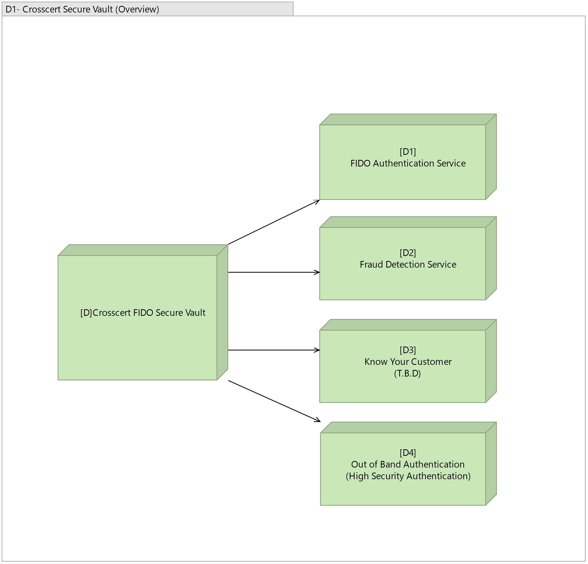

# Github Documents

- github + plantuml + archimate + marp
---

## Install
- [VSCode](https://code.visualstudio.com/)
- VSCode extension
    - plantuml
    
    - marp
    
---

# PlantUML
- [plantuml website](https://plantuml.com/ko/archimate-diagram)

---
- plantuml code path
    - [diagrams/src/](./diagrams/src/)
    

- 이미지 생성 
    1. Right click on "diagrams" folder
    2. Left click on "Export Workspace Diagrams"
---

- Archimate Diagram List

---
- Sample

---
- FIDO Image Sample

---
- FIDO Plantuml Sample(image version)
 

---
- FIDO Plantuml Sample(code version)

